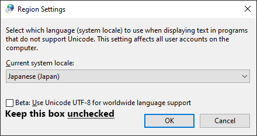
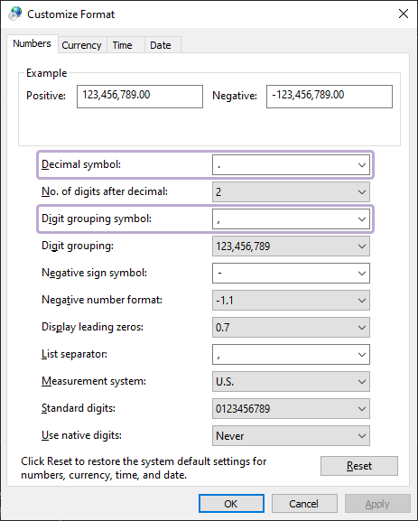
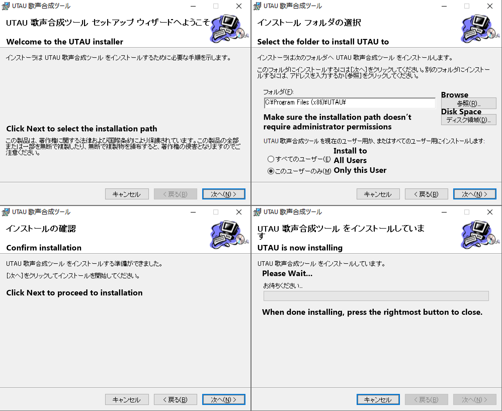

## Changing Locale

To use UTAU and and its plugins, you must change your locale to Japanese. This will not change your system language, but will change backslashes into yen signs in console.

Change your PC's Locale to Japanese by opening Control Panel, then `Clock and Region > Change date, time, or number formats > Administrative > Change System Locale > Japanese (Japan)`.

You may also need to change the units of measurement for UTAU to function correctly. To do this, go to `Control Panel > Clock and Region > Change date, time, or number formats > Additional Settings... > Numbers`. Make sure the decimal symbol is `.`, and the digit grouping symbol is `,`.

## Installing Japanese Keyboard (Recommended)

If you would like to type into UTAU easier, you may want to install the Japanese keyboard. To add the Japanese keyboard, go to Settings and navigate to `Time and Language > Language > Keyboard > Preferred Languages > Add a language`. Then, search for Japanese and select it. Unselect all the optional language features.

## Downloading

To download the latest version of UTAU, click `v0.4.18e インストーラ` on [UTAU's Homepage](http://utau2008.xrea.jp/).

## Installation

Click the rightmost button until installation is finished.

 