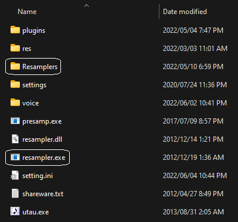
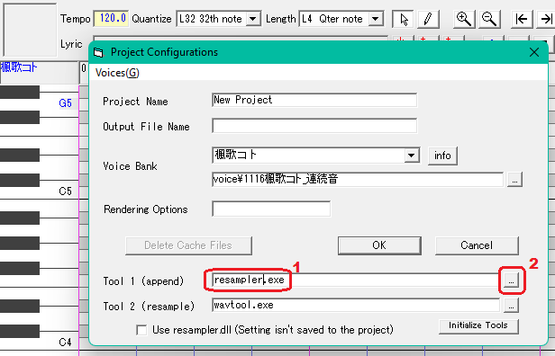
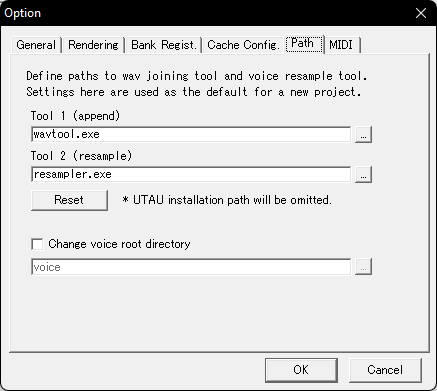

!!! note 

        To-do: Add information about frq files, fix `resampler2.png`
  

## About Resamplers

A resampler is an application that acts as a [vocoder](https://en.wikipedia.org/wiki/Vocoder) for UTAU - that is, it processes the raw samples of a voicebank so that they synthesize properly.

Each resampler processes samples in a different way, and so some suit certain voicebanks more than others. For example, one resampler may handle breathy or whispery samples better than others, while another might make high notes sound more nasally.

Changing the resampler isn't necessary for someone just starting to use UTAU. However, voicebanks usually have recommended resamplers noted in their readme that are not the default `resampler.exe`, and you can greatly improve the quality of the vocals by trying out other resamplers.

## About Wavtools

UTAU also uses an application called a wavtool for audio playback. These stitch together the files processed by the resampler so that they can be played back in the correct order.

While the default wavtool is perfectly fine for a beginner, the wavtools provided by the community can sound smoother or sometimes have extra features. A list of available wavtools can be found [here](/resources/wavtools).

## Options

Popular resamplers include the default resampler, [doppeltler](/resources/resamplers/#doppeltler), [moresampler](/resources/resamplers/#moresampler), and [f2resamp](/resources/resamplers/#f2resamp).

A list of available resamplers and their qualities (eventually) can be viewed [here](/resources/resamplers/).

## Installation

Resamplers usually come in a compressed folder (like .zip or .rar). Extract this wherever you want with your desired program.
Resamplers don't need to be in a specific directory, but it's recommended to put them next to the UTAU exe or in a nearby folder for easy access, like so.

 

## Usage

In a new or open project file, click on the voicebank's name above the piano roll to open the Project Configuration menu. You can also click `Project(P) > Project Properties(R)` in the top menu. This window will automatically pop up in certain cases.

 

- 1: You can type in the relative (`Resamplers/resampler.exe`) or absolute path (`C:/Applications/UTAU/Resamplers/resampler.exe`) to a resampler here.
- 2: If you don't want to type in the path by hand, you can click this button and select your resampler in the menu that pops up.

If you're confused on which file to select after downloading a resampler, remember that resamplers are **always** `.exe`s. If there are multiple exe files, select the one

Once you've selected your resampler, click OK. UTAU will now use the selected resampler every time you open this UST!

To change the wavtool, it's the same process, except you would change `tool2 (append)` instead of `tool1 (resample)`.

## Setting a default resampler

If you have a resampler that you commonly use and don't want to select it in every new project, you can change UTAU's default resampler in the settings.

Go to `Tools(T) > Option(O) > Path` and edit Tool 2, then hit OK. `Reset` will change the values back to default.

 
