# JP CVVC oto Reference `WORK IN PROGRESS`

Based off of Delta's CVVC otoing guide [here](https://delta-kimigatame.hatenablog.jp/entry/ar533241).

## Phoneme List

### Consonants

!!! note
    If your R sounds like an english L, it's a soft consonant and not a plosive consonant

#### Plosive

Voiceless

k, t, p, ts, ch

Voiced

g, d, b, j, r

#### Soft

s, n, h, m, y, r, w

## CVs

### Initial Vowel

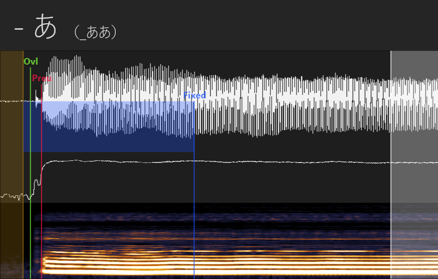{ width=80% }

| Name | Where |
|-|-|
| Left Blank/Offset | start of audible sound |
| Overlap | inbetween Left Blank and Preutterance |
| Preutterance | start of vowel |
| Fixed/Consonant | where the vowel is consistent |
| Right Blank/Cutoff | before the vowel ends |

### Crossfade Vowel

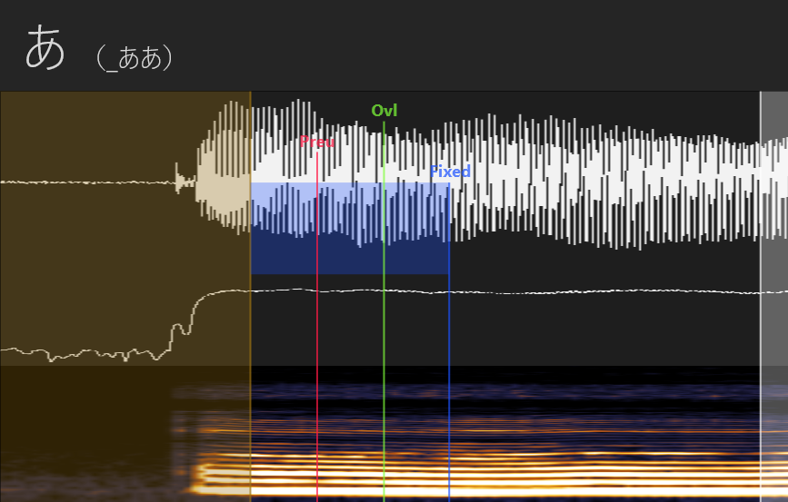{ width=80% }

### Initial CV

=== "Soft Consonant"

    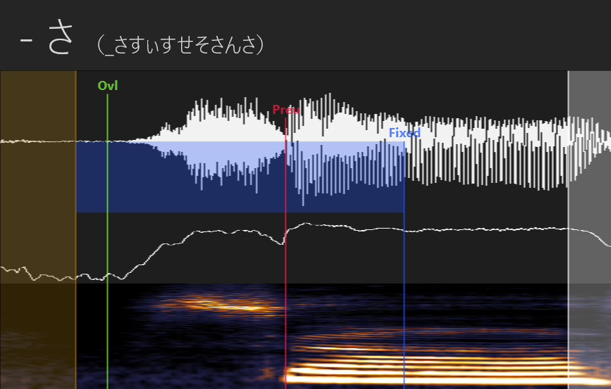{ width=80% }

    | Name | Where |
    |-|-|
    | Left Blank | after last vowel / when silence starts |
    | Overlap |  |
    | Preutterance | after consonant / beginning of vowel |
    | Consonant/Fixed | where the vowel is consistent after the consonant |
    | Right Blank | where the vowel is consistent before the end |

=== "Plosive Consonant"

    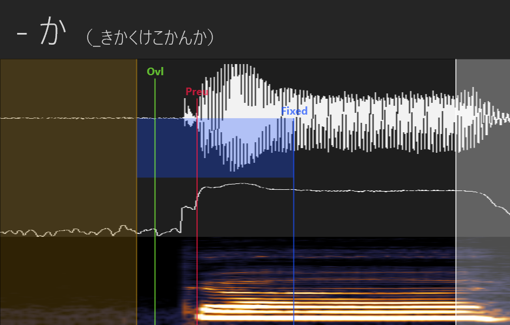{ width=80% }
    
    | Name | Where |
    |-|-|
    | Left Blank | before consonant |
    | Overlap | after left blank/before preutterance |
    | Preutterance | after consonant/beginning of vowel |
    | Consonant/Fixed | where the vowel is consistent in pronunciation and volume after the consonant |
    | Right Blank | where the vowel is consistent before the end |

### CV

=== "Soft Consonant"

    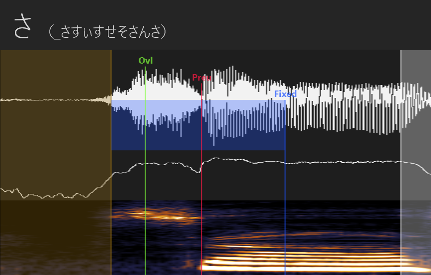{ width=80% }

    | Name | Where |
    |-|-|
    | Left Blank | after last vowel / when silence starts |
    | Overlap |  |
    | Preutterance | after consonant / beginning of vowel |
    | Consonant/Fixed | where the vowel is consistent after the consonant |
    | Right Blank | where the vowel is consistent before the end |

=== "Plosive Consonant"

    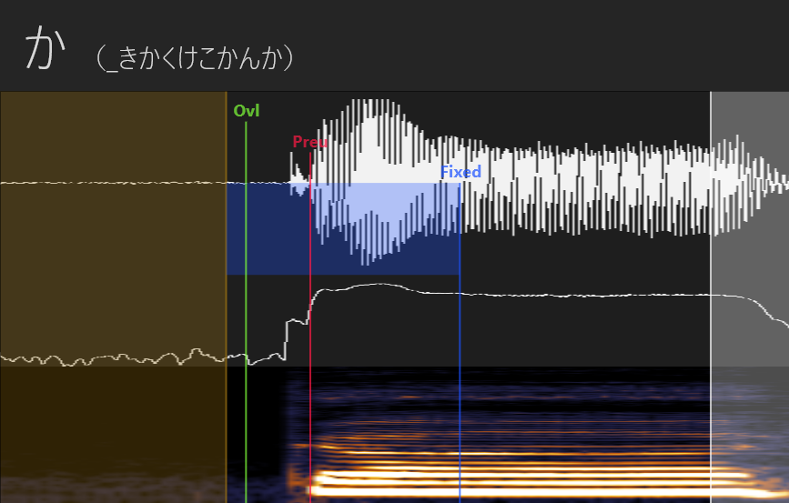{ width=80% }

    | Name | Where |
    |-|-|
    | Left Blank | after last vowel / when silence starts |
    | Overlap |  |
    | Preutterance | after consonant / beginning of vowel |
    | Consonant/Fixed | where the vowel is consistent after the consonant |
    | Right Blank | where the vowel is consistent at the end |

=== "Plosive Voiced Consonant"

    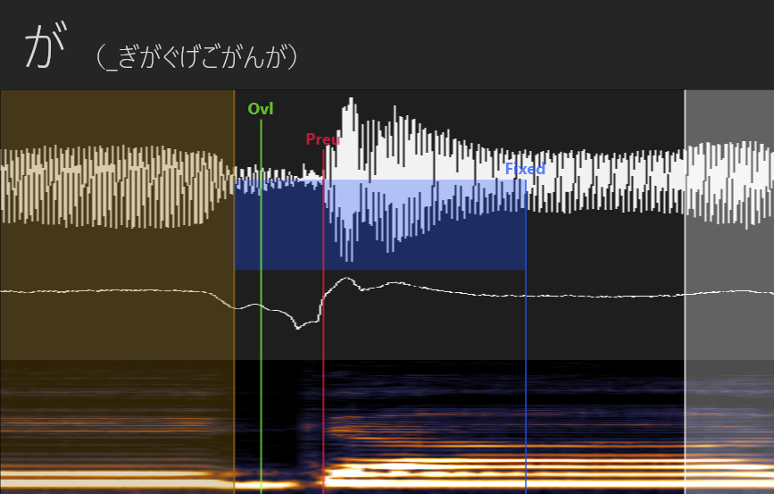{ width=80% }

    | Name | Where |
    |-|-|
    | Left Blank | after last vowel / when silence starts |
    | Overlap |  |
    | Preutterance | after consonant / beginning of vowel |
    | Consonant/Fixed | where the vowel is consistent after the consonant |
    | Right Blank | where the vowel is consistent at the end |

## VCs

=== "Soft Consonant"

    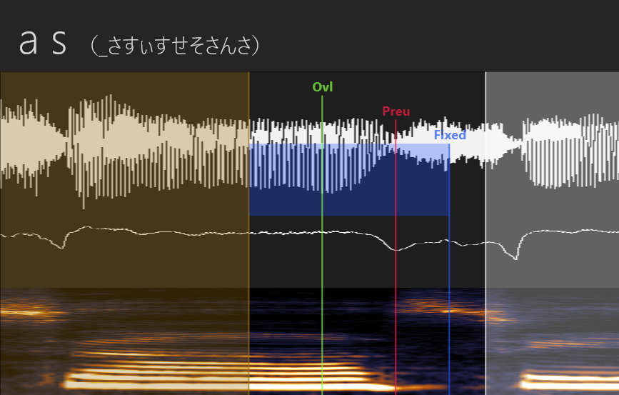{ width=80% }

    | Name | Where |
    |-|-|
    | Left Blank | after last vowel / when silence starts |
    | Overlap |  |
    | Preutterance | after consonant / beginning of vowel |
    | Consonant/Fixed | where the vowel is consistent after the consonant |
    | Right Blank | where the vowel is consistent before the end |

=== "Plosive Consonant"

    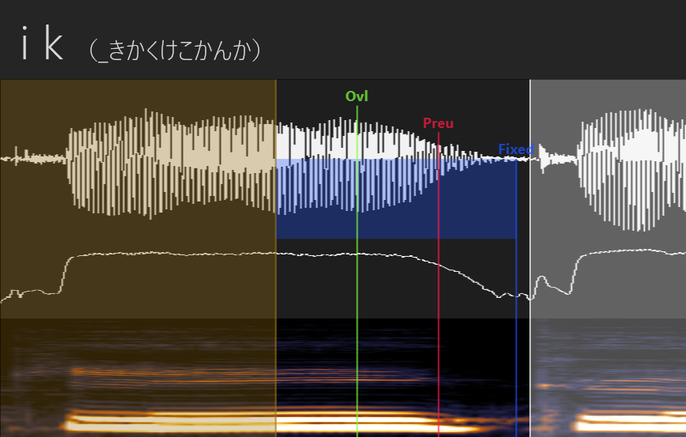{ width=80% }

    | Name | Where |
    |-|-|
    | Left Blank | after last vowel / when silence starts |
    | Overlap |  |
    | Preutterance | after consonant / beginning of vowel |
    | Consonant/Fixed | where the vowel is consistent after the consonant |
    | Right Blank | where the vowel is consistent at the end |

=== "Plosive Voiced Consonant"

    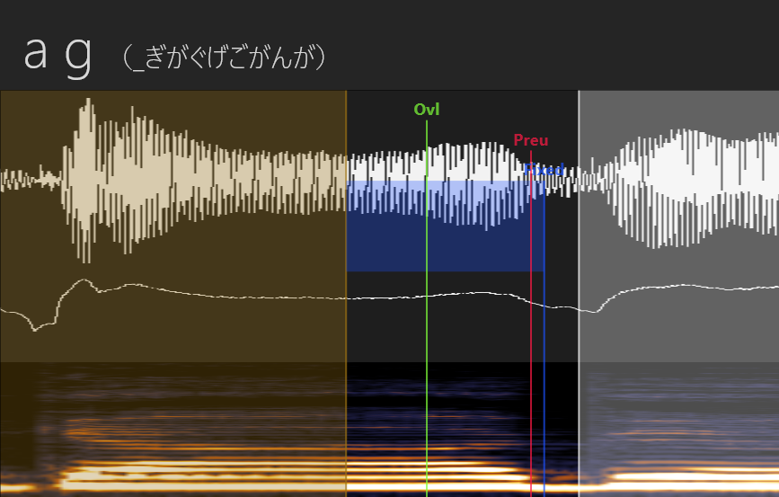{ width=80% }

    | Name | Where |
    |-|-|
    | Left Blank | after last vowel / when silence starts |
    | Overlap |  |
    | Preutterance | after consonant / beginning of vowel |
    | Consonant/Fixed | where the vowel is consistent after the consonant |
    | Right Blank | where the vowel is consistent at the end |

=== "Plosive Consonant End"

    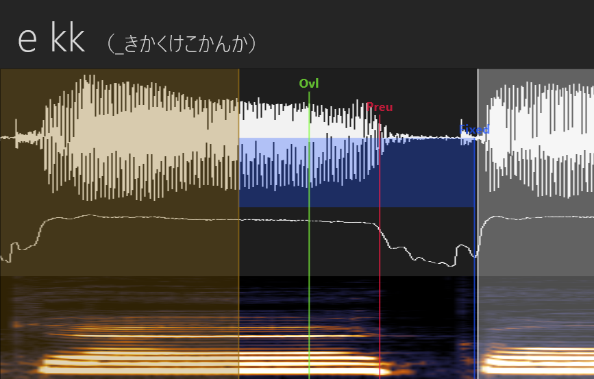{ width=80% }

    | Name | Where |
    |-|-|
    | Left Blank | after last vowel / when silence starts |
    | Overlap |  |
    | Preutterance | after consonant / beginning of vowel |
    | Consonant/Fixed | where the vowel is consistent after the consonant |
    | Right Blank | where the vowel is consistent at the end |

## Cs

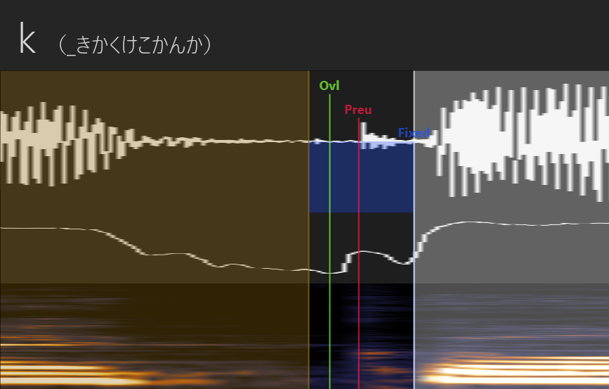{ width=80% }